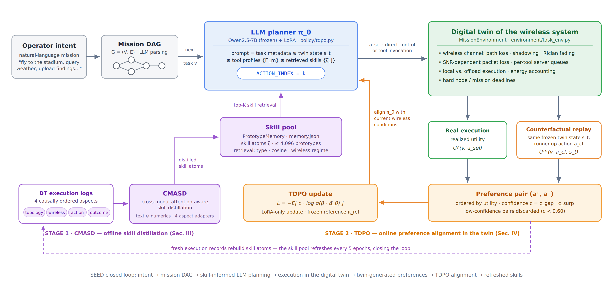
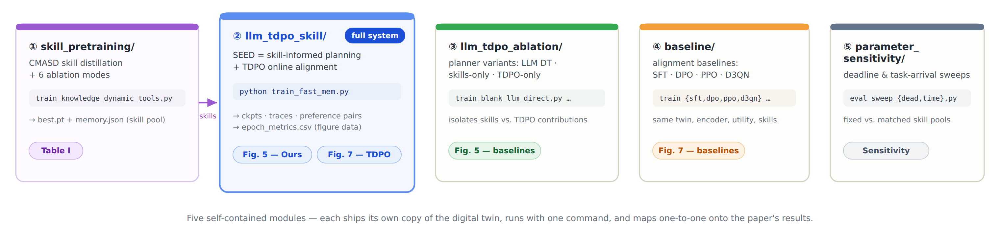

# SEED: A Skill-Driven and Tool-in-the-Loop Digital Twin for Closed-Loop Wireless Applications

**This is the complete, runnable implementation of SEED** — every algorithm, every baseline, every ablation, and every sensitivity study reported in the paper is in this repository, each reproducible with a single command.

SEED turns a passive wireless Digital Twin into a **proactive execution agent**: it takes a natural-language mission intent, plans each task with an LLM guided by **skills distilled from DT logs (CMASD)**, executes via direct control or external tool invocation over a non-stationary wireless network, and continuously aligns its policy using **DT-simulated counterfactual preferences (TDPO)** — no oracle labels, no hand-crafted reward model.

<p align="center">
<b>+62.9%</b> mission completion rate&nbsp;&nbsp;·&nbsp;&nbsp;<b>−59.8%</b> constraint violations&nbsp;&nbsp;·&nbsp;&nbsp;<b>+17.2%</b> latency efficiency<br>
<i>vs. state-of-the-art DT baselines (Fig. 5, Section V)</i>
</p>

---

## ⏱️ Five-Minute Tour

**Everything in the paper has a concrete home in this repo.** If you only have five minutes, this table is the whole story:

| What the paper claims | Where it is implemented | One command to run it |
|---|---|---|
| **SEED full system** (skills + TDPO, "Ours" in Fig. 5) | [`llm_tdpo_skill/`](llm_tdpo_skill) | `python train_fast_mem.py` |
| **CMASD** skill distillation (Section III) | [`skill_pretraining/`](skill_pretraining) | `python train_knowledge_dynamic_tools.py` |
| **TDPO** policy alignment (Section IV) | [`llm_tdpo_skill/llm_tdpo/policy/tdpo.py`](llm_tdpo_skill) | (runs inside the command above) |
| **The digital twin itself** — wireless channel, tool queues, deadlines, energy | `*/environment/task_env.py` (every module) | exercised by every experiment |
| 3 planner baselines: *LLM DT*, *Skill-enhanced LLM*, *LLM w/ TDPO* (Fig. 5) | [`llm_tdpo_ablation/`](llm_tdpo_ablation) | `python train_blank_llm_direct.py` (etc.) |
| 4 alignment baselines: **SFT / DPO / PPO / D3QN** (Fig. 7) | [`baseline/`](baseline) | `python train_sft_baseline.py` (etc.) |
| 6 CMASD ablations (Table I) | [`skill_pretraining/`](skill_pretraining) | `bash launchers/run_cmasd_ablation_all.sh serial` |
| Environment sensitivity sweeps | [`parameter_sensitivity/`](parameter_sensitivity) | `python tdpo/eval_sweep_dead.py` (etc.) |

**And if you want to verify the three core technical claims directly in source:**

| Core claim | Look here | What you will find |
|---|---|---|
| *"The DT simulates counterfactual actions under the frozen twin state"* (Eq. 25) | `llm_tdpo/policy/tdpo.py` → `sandbox_utilities()`, `choose_counterfactual_action()` | the twin's own timing / queue / channel predictors re-scoring every legal action **without executing it** |
| *"Preference pairs are confidence-weighted, c = c_gap · c_surp"* (Eq. 28) | `llm_tdpo/policy/tdpo.py` → `build_tier_a_pair()`, `build_tier_b_pairs()` | `conf = sigmoid(utility gap) × wireless-similarity`, pairs below the 0.60 floor discarded |
| *"Skills bind topology, wireless, action, outcome via cross-modal attention"* (Eqs. 13–17) | `skill_pretraining/.../knowledge/base_adapter.py` → `LLMFourHeadDistiller`, `AspectAdapter`, `PrototypeMemory` | four aspect-specific adapters on a frozen Qwen backbone; text queries attending over per-record numerical keys/values; online skill-pool clustering |

---

## 🏗️ How the Pieces Fit Together

<p align="center">
  
</p>

Two training stages, fully decoupled:

1. **`skill_pretraining/` → CMASD.** Roll out missions in the twin, partition every log into four causally ordered aspects (*topology → wireless → action → outcome*), and distill them into retrievable **skill atoms** via textual–numerical cross-modal attention. Output: `best.pt` + `memory.json` (the skill pool).
2. **`llm_tdpo_skill/` → SEED.** The LLM planner (Qwen2.5-7B + LoRA) reads the twin state, tool profiles, and top-K retrieved skills, and emits an action. After each real execution, the twin **replays the identical state with a counterfactual action**; the resulting utility-ordered pair, weighted by confidence, drives a DPO-style update. The skill pool is refreshed from fresh execution records every 5 epochs — the loop is closed.

---

## 📁 Repository at a Glance

<p align="center">
  
</p>

Three engineering decisions worth knowing up front:

- **Every module is self-contained.** Each ships its own copy of the twin environment and skill memory, so any experiment reproduces in isolation — no hidden cross-module coupling, no version drift between the numbers in different figures.
- **Fairness is enforced by construction.** All baselines share the *same* twin environment, the *same* frozen Qwen backbone, the *same* utility definition, and (where applicable) the *same* pretrained skill pool. Only the learning rule differs.
- **Minimal dependency surface.** `torch` + `transformers` only. LoRA, bottleneck adapters, the DPO loss, PPO, and D3QN are all implemented in this repo — nothing is hidden behind PEFT/TRL, so every training detail is auditable in source.

---

## 🚀 Quick Start

```bash
# 0. Requirements: Python ≥ 3.10, 1× A100 (or 4× 24 GB GPUs via device_map="balanced")
pip install torch transformers

# 1. Point paths at your local Qwen2.5-7B checkpoint and the mission dataset
#    — each module has exactly ONE config file: <module>/config/paths.py
vim skill_pretraining/knowledge_pretraining/config/paths.py

# 2. Stage 1 — distill the skill pool from DT logs (CMASD)
cd skill_pretraining && python train_knowledge_dynamic_tools.py
#    → <run_dir>/{loss.csv, best.pt, memory.json}

# 3. Stage 2 — train SEED (skill-informed planning + TDPO alignment)
cd ../llm_tdpo_skill              # point paths.py at the best.pt / memory.json from step 2
python train_fast_mem.py
#    → <run_dir>/{epoch_metrics.csv, ckpts/, traces/, pairs/, knowledge/}
```

Every run writes `epoch_metrics.csv` — mission completion rate, latency, energy, #tasks, #violations per epoch — which is exactly the data plotted in the paper's figures. Runs are timestamped and never overwrite each other; each run directory carries a full `run_config.json` snapshot for reproducibility.

> **Dataset & models are not bundled** (anonymized-artifact policy): you need a local Qwen2.5-7B checkpoint and the wireless mission dataset (2,000 operator intents with task-decomposition DAGs and tool libraries, generated with DeepSeek V4 and manually verified — see the paper's AI-use disclosure). All expected formats are documented in each module's `config/paths.py`.

---

## 🧪 Reproducing Every Result in the Paper

| Paper result | Commands |
|---|---|
| **Fig. 5** — closed-loop execution, *Ours* | `llm_tdpo_skill$ python train_fast_mem.py` |
| **Fig. 5** — *LLM DT* | `llm_tdpo_ablation$ python train_blank_llm_direct.py` |
| **Fig. 5** — *Skill-enhanced LLM* | `llm_tdpo_ablation$ python train_blank_llm_skill_memory.py` |
| **Fig. 5** — *LLM with TDPO* | `llm_tdpo_ablation$ python train_TDPO_no_skill.py` |
| **Fig. 7** — SFT / DPO / PPO / D3QN | `baseline$ python train_{sft,dpo,ppo,d3qn}_baseline.py` |
| **Fig. 7** — 5-method comparison figure | `baseline$ python make_mlx_bar_from_5_csv.py` |
| **Table I** — all 6 CMASD ablations | `skill_pretraining$ bash launchers/run_cmasd_ablation_all.sh serial` &nbsp;(or `parallel4` for 4 GPUs) |
| Sensitivity — deadline tightness | `parameter_sensitivity$ python tdpo/eval_sweep_dead.py` |
| Sensitivity — task arrival rate | `parameter_sensitivity$ python tdpo/eval_sweep_time.py` |

Ablation-mode names map to Table I as: `full`, `single_modal_numeric` (w/o numerical), `no_fusion`, `no_topo`, `no_wire`, `action_out_only` (act. + outcm.).

---

## 🔬 What Makes This Implementation Non-Trivial

**The digital twin is a real simulator, not a stub.** `task_env.py` is an event-driven mission simulator with: distance-dependent path loss (exponent 2.7) + log-normal shadowing (σ = 4 dB) + Rician fading (K = 4), SNR-dependent packet loss, per-tool-server queues with admission and reliability, local-vs-offload execution, per-action energy accounting, and hard node/mission deadlines. Its predictive timing models are the *same code* that powers TDPO's counterfactual simulation — the "twinned" in TDPO is literal.

**Skills are engineered, not just prompted.** CMASD trains four aspect-specific bottleneck adapters inside a frozen Qwen backbone (layers −8/−6/−4/−2), fuses textual and numerical evidence with learned cross-modal attention, masks the target task's outcome during training so the heads must *predict* rather than copy, and consolidates atoms into a bounded prototype memory (≤ 4,096 prototypes, hybrid retrieval: 0.4·type + 0.4·cosine + 0.2·wireless-regime). Retrieved skills are injected as a compact text block — the prompt redesign that made this fit is itself audited in-repo (`llm_tdpo_skill/tests/`: average prompt length reduced 1,652 → 994 tokens, with shipped JSON reports in `data/reference/`).

**TDPO is more than a DPO call.** Preference pairs (same-state counterfactual pairs and legality pairs that *teach* the action grammar instead of masking it), confidence floors/caps to discard uninformative pairs, cached frozen-reference log-probs, a bounded pair buffer, and LoRA-only updates (r = 8, last 4 blocks) so the reference stays honest. Single-GPU training is made possible by explicitly releasing the skill-side backbone before loading the policy backbone.

**The evaluation is symmetric by design.** The four alignment baselines (SFT/DPO/PPO/D3QN) run on the same frozen encoder, same environment, same utility, same skill pool — implemented head-only so the comparison isolates *the learning rule*, which is precisely the paper's claim.

---

## 📚 Deep-Dive Reference

<details>
<summary><b>Full paper ↔ code mapping (every equation to its function)</b></summary>

| Paper (Section / Eq.) | Code |
|---|---|
| Mission DAG `G = (V, E)`, task tuple `(τ, d, C, Ω)` (§II-B) | dataset JSON graphs; `load_dataset_from_dir`, `DatasetIndex` |
| DT state `s_t` (Eq. 2) | `MissionEnvironment.collect_decision_points` → decision context |
| Wireless channel & rate model (§II-D) | `_channel_snapshot`, `_predict_tool_timing`, `_predict_local_timing` |
| Tool profile `Π_m` (Eq. 3); latency & energy (Eqs. 4–5) | `ToolTypeProfile`; queue/reliability/coverage model; `estimate_energy_proxy` |
| Four-aspect log segmentation (Eq. 7) | `SegmentExtractor`, `aspect_names = ("topo", "wire", "tool", "out")` |
| Numerical encoders φ_G, φ_W, φ_A, φ_O (Eq. 9) | per-aspect `MLP` encoders in `base_adapter.py` |
| Aspect-conditioned adapters `A_q^(l)` (Eqs. 10–12) | `AspectAdapter` (bottleneck-64, zero-init), `LLMBackbone.use_aspect` |
| Cross-modal fusion weights β (Eq. 13) | `block_gate` softmax in `LLMFourHeadDistiller` |
| Cross-modal attention (Eqs. 14–16) | `_attend`: text query over per-record numeric keys/values |
| Skill atom `ζ` & decoded priors (Eqs. 17–18) | `KnowledgeAtom` with risk / gain / confidence heads + auto-generated explanation |
| Skill consolidation & retrieval (§III-E) | `PrototypeMemory.add_atom` (merge at cosine ≥ 0.75) / `.query` (top-K = 3) |
| Structured prompt `x_{v,n}` (Eq. 19); action selection (Eq. 20) | `build_prompt_from_dp` → `"ACTION_INDEX=k"` generation |
| Post-execution utility `U^p` (Eq. 24) | `realized_utility`, `completion_first_utility` |
| DT counterfactual `Û^DT` (Eq. 25); pair rule (Eqs. 26–27) | `sandbox_utilities`, `choose_counterfactual_action`, `build_tier_a_pair` |
| Confidence `c = c_gap · c_surp` (Eq. 28) | `sigmoid(gap) × wireless_similarity_confidence`, floor 0.60 / cap 0.85 |
| TDPO objective (Eqs. 22–23, 29) | confidence-weighted `−c·logsigmoid(β·Δ̂_θ)`, β = 0.05, cached reference log-probs |

</details>

<details>
<summary><b>Module guide (what each directory contains and produces)</b></summary>

**① `skill_pretraining/`** — CMASD. `train_knowledge_dynamic_tools.py` runs a 300-epoch loop: heuristic closed-loop rollouts in the twin accumulate logs → `SegmentExtractor` produces four-aspect features → `LLMFourHeadDistiller` trains adapters/gates/attention/heads end-to-end (outcome of the target task masked) → `PrototypeMemory` consolidates skill atoms (cleared during a 100-epoch warm-up so only mature skills persist). `train_knowledge_dynamic_tools_ablation.py --mode <m>` runs one Table-I variant; `launchers/` provides serial and 4-GPU parallel sweeps. Outputs per run: `loss.csv`, `best.pt`, `memory.json`.

**② `llm_tdpo_skill/`** — SEED. `train_fast_mem.py` orchestrates: sample mission DAGs → build twin → skill-informed prompting (`build_prompt_from_dp`, skills ≤ 1,200 chars) → execute → attach realized utilities → simulate counterfactuals → build Tier-A / Tier-B / legality pairs → TDPO update (LoRA) → refresh skill pool every 5 epochs. `tests/` contains three runnable diagnostics (prompt token length, action legality rollout, old-vs-new prompt diff) with their original JSON reports shipped in `data/reference/`. `rematch_epoch75_task1090_skills.py` re-runs skill retrieval offline for a traced task and reproduces the runtime prompts exactly (100% match).

**③ `llm_tdpo_ablation/`** — three planner variants registered in `config/variants.py`: `blank_llm_direct` (frozen LLM, no skills, no TDPO), `blank_llm_skill_memory` (skills only), `tdpo_no_skill` (TDPO only). Invalid actions fail the task (`invalid_action_mode = "fail_task"`) — legality is measured, not assumed.

**④ `baseline/`** — one entry point per algorithm on a shared runtime: SFT (imitates the heuristic teacher — deliberately showing why imitation saturates without oracle labels), DPO (cross-episode pairs, β = 0.10 — the contrast to TDPO's same-state pairs), PPO (clipped contextual-bandit, value head), D3QN (dueling double DQN, replay 4,096). `make_mlx_bar_from_5_csv*.py` renders the five-method comparison (PNG/PDF + CSV/MATLAB exports).

**⑤ `parameter_sensitivity/`** — grid of environment cases (`case_{i}_arrival_{a}_deadline_{d}`): skills pretrained per case, then evaluated across cases. The `*_same` variants hold one fixed skill pool across all environments, cleanly separating *environment difficulty* from *skill-selection benefit*. Evaluations aggregate into `combined_summary.csv`.

</details>

<details>
<summary><b>Key hyperparameters</b></summary>

| Component | Setting |
|---|---|
| LLM backbone (policy & CMASD) | Qwen2.5-7B, frozen, bfloat16, gradient checkpointing |
| Policy adaptation | LoRA r=8, α=16, dropout 0.05, last 4 blocks (q/k/v/o/gate/up/down_proj) |
| CMASD adapters | bottleneck 64, layers (−8, −6, −4, −2), one adapter set per aspect |
| Skill pool | merge threshold 0.75, top-K = 3, ≤ 4,096 prototypes |
| TDPO | β = 0.05, lr 1e-5, batch 64, pair buffer 8,192, confidence ∈ [0.60, 0.85], legality pairs 0.98 |
| Twin environment | Δt = 0.1 s, 2.4 GHz, path-loss exp. 2.7, shadowing σ = 4 dB, Rician K = 4, SNR-sigmoid packet loss |
| Training scale | CMASD 300 epochs · SEED & baselines 100 epochs · 20 DAGs/epoch · fixed seeds |

All values live as named globals at the top of each runner/policy file — grep the name to change it.

</details>

<details>
<summary><b>Glossary: code names → paper names</b></summary>

The codebase predates the paper's final terminology:

| In the code | In the paper |
|---|---|
| `knowledge` / `knowledge_pretraining` | skill distillation (CMASD) |
| `KnowledgeAtom` | skill atom ζ |
| `PrototypeMemory` / `memory.json` | skill pool |
| aspects `"tool"`, `"out"` | action aspect, outcome aspect |
| `sandbox_utility` | DT counterfactual simulation Û^DT |
| Tier-A / Tier-B / legality pairs | DT-generated preference dataset D_TDPO |
| `MissionEnvironment` | the digital twin |
| heuristic teacher | bootstrap policy for log generation (not an oracle) |

</details>

<details>
<summary><b>Outputs & logging</b></summary>

Every run directory contains: `epoch_metrics.csv` (the figure data), `energy.csv` / `delay.csv` (per-epoch decompositions), `eval_metrics.csv` (greedy evaluation), `ckpts/` (`best.pt` + per-epoch), `traces/traces.jsonl` (every decision: prompt, twin state, action, counterfactual, utilities), `pairs/pairs.jsonl` (every preference pair with confidence and reference log-probs), `knowledge/memory.json` (skill pool snapshots), and `run_config.json` / `final_result.json`.

In other words: **every number in the paper can be traced from figure → CSV → the individual decisions that produced it.**

</details>

---

## 📄 Disclosure & Anonymity

DeepSeek V4 was used to generate operator intents, task-decomposition graphs, and tool libraries in the dataset; all were manually verified by the authors (see the paper's AI-use disclosure). This repository is anonymized for double-blind review via Anonymous GitHub; author information will be restored upon acceptance.
